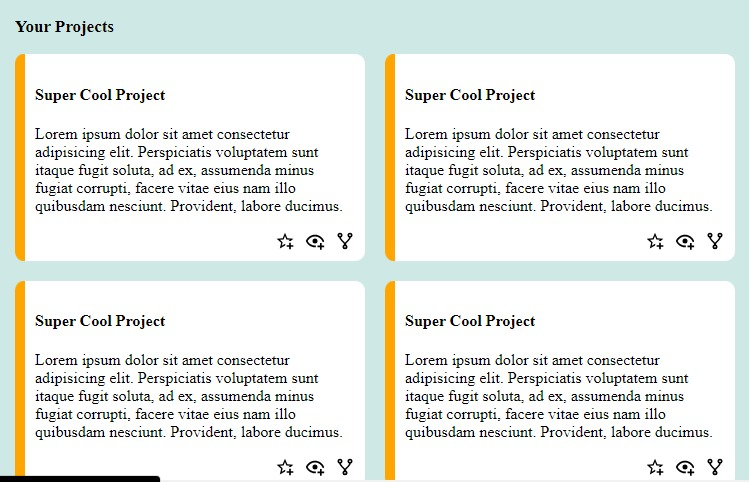

# Instructions
- Fork the repo to your git account
- clone the forked repo
- add your own html file (must end with your name to avoid conflics) and work on it (choose one of the options listed below)
- apply what you learned about git and github (updating changes, committing adding files and stuff)
-you can create a css file or use the existing one if you want
All necessary icons (images are under images folder), to use an image just say
```html
 <object data="images/home.svg" width="20" type=""></object>
```
 home.svg can be replaced by any image that's available

 You can choose to build one of the following 
 ## Option 1
 - If you don't know anything about html and css just create a simple html page that will say hi my name is "your name" and follow what was done today in class
 - DON'T WORRY YOU WILL LEARN THE CONTENT NEXT WEEK
 ## Option 2
 

 ## Option 3
  

  ## Option 4
   

   ## Option 5
 
 ## Option 6 (If you have the energy)
 <a href="https://mashigovincent01.github.io/TheOrdinProject_02_AdminDashboard/"> My Admin Dashboard </a>
